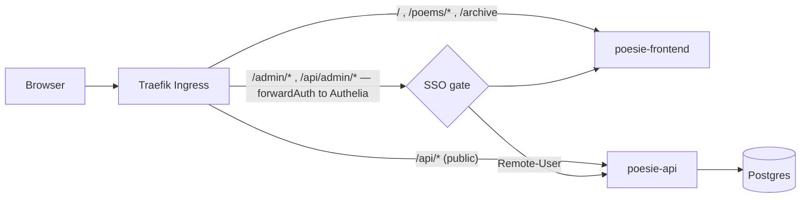

# Architecture

How `io.m3i.poesie_du_lundi`'s system is put together. The **why** behind the layout is in
[ENGINEERING_PRACTICES.md](ENGINEERING_PRACTICES.md); deployment — k3s, CI/CD, TLS, SSO wiring —
is in [README.md](../README.md). This document is a skeleton, filled in as the app is built.

## Shape

A poetry blog: a **public, anonymously-readable site** plus a **small SSO-gated authoring
area**. Same infrastructure story as `io.m3i.ledgy` (PostgreSQL + .NET 10 + React, Docker, k3s
on the shared OVH VPS), a lighter API.

```
frontend/   Vite + React, built to static files, served by nginx.
              modules/reading   — the public site (/, /poems/:slug, /archive, /series/:slug)
              modules/authoring — the admin editor, mounted under /admin (SSO-gated)
api/        ASP.NET Core, ONE project (PoesieDuLundi), DDD layering by namespace:
              Domain/         aggregates, value objects            — BCL only
              Application/    one use case per operation           — → Domain
              Infrastructure/ PoesieDuLundiDbContext, EF configs, migrations, read models
              Api/            minimal-API endpoints + DTOs
                Api/Public/   anonymous  — GET published content, feeds
                Api/Admin/    SSO-gated  — CRUD drafts, schedule, publish
k8s/        production deployment — Deployments+Service for api/frontend, StatefulSet for
              Postgres, two Ingress resources (public anonymous + /admin gated), namespace `poesie`.
docker-compose.yml   local dev only — not what's deployed.
```

Dependencies point one way: `Api → Application → Domain`, `Infrastructure → Application, Domain`.
`Domain` has no `PackageReference` to EF Core / ASP.NET Core / Npgsql. Enforced by
`Architecture.Tests` (NetArchTest over namespaces, since there's one project — see
ENGINEERING_PRACTICES.md "This app's layout").

## Domain (planned — see the Foundation + MVP issues)

| Aggregate | Owns |
| --- | --- |
| `Poem` | title, body (Markdown), `Slug`, `Series` link, status (`Draft`/`Scheduled`/`Published`), `PublicationDate`, `Tags` (slugged, jsonb) |
| `Series` | a themed cycle / "saison" grouping poems — title, slug, description, order |
| `Author` | display name, bio, avatar; keyed by the SSO subject (`Remote-User`) |

One `PoesieDuLundiDbContext`, its own `__EFMigrationsHistory` table. `DatabaseMigrator` runs
migrations as the `migrate` init container on every rollout.

## Request flow



- Public paths reach the API/frontend with no auth middleware.
- `/admin` and `/api/admin` go through the shared `auth-forward-auth@kubernetescrd` Middleware
  (owned by `io.m3i.auth`, consumed cross-namespace). `Remote-User` → the `Author` making the
  edit. Single shared content space (not tenant-per-user) — see ENGINEERING_PRACTICES.md.
- Same-origin: one domain, no CORS.

## Publishing model

Poems are written as drafts, then **scheduled for a Monday** ("la poésie du lundi"). A
scheduled poem becomes visible when its `PublicationDate` arrives — resolved on read
(`status == Scheduled && PublicationDate <= today` counts as published in the public query) so
no background scheduler is required for correctness; a lightweight recurring job only
materialises the transition and triggers side effects (feeds cache bust, later: newsletter).

## Feeds & SEO

RSS 2.0 + Atom + JSON Feed of published poems, `sitemap.xml`, `robots.txt`, per-poem
OpenGraph/meta tags. These are first-class MVP, not an afterthought — the public site's reach
depends on them.

`sitemap.xml` and `robots.txt` are generated by the API (`PublicSeoEndpoints`) from the same
read models the public API and feeds use, but mapped at the document root rather than under
`/api` — `robots.txt` is only honoured there by convention, and the sitemap sits next to it for
the same reason. The public Ingress (`k8s/ingress.yaml`) and `frontend/nginx.conf` each carry an
explicit `/robots.txt` / `/sitemap.xml` route to the API ahead of the frontend's catch-all, since
both would otherwise fall through to the SPA's `index.html`.

**Rendering strategy for per-poem meta tags: client-side for real browsers, a User-Agent edge
shim for link-unfurling bots (issue #83).** The frontend is a plain Vite + React CSR SPA served as
static files by nginx (see "Request flow" above) — there is no SSR runtime, and adding one is a
meaningful infrastructure change this feature doesn't need. `PoemPage` sets its `<title>`,
`<meta name="description">`, canonical `<link>`, OpenGraph/Twitter tags, and `CreativeWork`
JSON-LD via React 19's native document-metadata support (`<title>`/`<meta>`/`<link>` rendered
anywhere in the tree are hoisted into `<head>`) — no `react-helmet` dependency needed. That covers
**Google and Bing, which render JavaScript before indexing.**

**Bots that unfurl link previews (Twitter/X, Facebook, Slack, Discord, …) do not execute
JavaScript** — they read OpenGraph/Twitter tags straight out of the initial HTML response, so
they never see `PoemPage`'s tags. For those specifically, `frontend/nginx.conf` matches
`$http_user_agent` against a `map` of known unfurl-bot substrings (Google's documented "dynamic
rendering" pattern) and, only for a `/poems/{slug}` request from one of them, rewrites to
`GET /api/poems/{slug}/unfurl` (`PublicPoemEndpoints`) instead of falling through to the SPA. That
endpoint server-renders a minimal HTML document with the same `<title>`/description/canonical/OG/
Twitter/JSON-LD content `PoemHead` would have produced client-side (description via `Excerpt`, a
server-side port of `frontend/src/shared/lib/excerpt.ts`'s Markdown-to-plain-text stripping) — no
`og:image` yet, since that's #31, deliberately out of scope here. Every other User-Agent, bot or
not, still gets the ordinary SPA route and never touches this endpoint.

## Draft preview links

`POST /api/admin/poems/{id}/preview-link` lets an author share a not-yet-published poem for
review without publishing it. The token is a stateless HMAC-SHA256 signature over the poem id and
an expiry (`PreviewTokenService`, `Preview:SigningKey`) — no DB row, so it costs nothing to issue
and needs no cleanup. `GET /api/poems/{slug}?preview=<token>` accepts it in place of the normal
published check, only for the one poem id the token was signed for. Only a poem that already has
a `PublicationDate` (Scheduled or Published) can be previewed — a bare Draft has no timeline
position (prev/next neighbours, the displayed date) to render, so it must be scheduled first
(409 otherwise). The previewed page carries `<meta name="robots" content="noindex, nofollow">`
(`PoemPage`, only when a `preview` token is present) so a leaked or crawled link doesn't get
indexed.

`Preview:SigningKey` must be set outside `Development`/`Testing` (`PreviewLinkStartupPolicy`
fails fast at startup otherwise) — production reads it from the same `poesie-api-config` k8s
Secret as the database connection string (`Preview__SigningKey` env var), kept stable across
replicas since the token carries no DB row to reconcile against.
