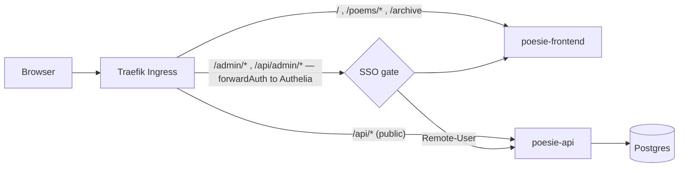

# Architecture

How `io.m3i.poesie_du_lundi`'s system is put together. The **why** behind the layout is in
[ENGINEERING_PRACTICES.md](ENGINEERING_PRACTICES.md); deployment — k3s, CI/CD, TLS, SSO wiring —
is in [README.md](../README.md). This document is a skeleton, filled in as the app is built.

## Shape

A poetry blog: a **public, anonymously-readable site** plus a **small SSO-gated authoring
area**. Same infrastructure story as `io.m3i.ledgy` (PostgreSQL + .NET 10 + React, Docker, k3s
on the shared OVH VPS), a lighter API.

```
frontend/   Vite + React, built to static files, served by nginx.
              modules/reading   — the public site (/, /poems/:slug, /archive, /series/:slug)
              modules/authoring — the admin editor, mounted under /admin (SSO-gated)
api/        ASP.NET Core, ONE project (PoesieDuLundi), DDD layering by namespace:
              Domain/         aggregates, value objects            — BCL only
              Application/    one use case per operation           — → Domain
              Infrastructure/ PoesieDuLundiDbContext, EF configs, migrations, read models
              Api/            minimal-API endpoints + DTOs
                Api/Public/   anonymous  — GET published content, feeds
                Api/Admin/    SSO-gated  — CRUD drafts, schedule, publish
k8s/        production deployment — Deployments+Service for api/frontend, StatefulSet for
              Postgres, two Ingress resources (public anonymous + /admin gated), namespace `poesie`.
docker-compose.yml   local dev only — not what's deployed.
```

Dependencies point one way: `Api → Application → Domain`, `Infrastructure → Application, Domain`.
`Domain` has no `PackageReference` to EF Core / ASP.NET Core / Npgsql. Enforced by
`Architecture.Tests` (NetArchTest over namespaces, since there's one project — see
ENGINEERING_PRACTICES.md "This app's layout").

## Domain (planned — see the Foundation + MVP issues)

| Aggregate | Owns |
| --- | --- |
| `Poem` | title, body (Markdown), `Slug`, `Series` link, status (`Draft`/`Scheduled`/`Published`), `PublicationDate`, `Tags` (slugged, jsonb) |
| `Series` | a themed cycle / "saison" grouping poems — title, slug, description, order |
| `Author` | display name, bio, avatar; keyed by the SSO subject (`Remote-User`) |

One `PoesieDuLundiDbContext`, its own `__EFMigrationsHistory` table. `DatabaseMigrator` runs
migrations as the `migrate` init container on every rollout.

## Request flow



- Public paths reach the API/frontend with no auth middleware.
- `/admin` and `/api/admin` go through the shared `auth-forward-auth@kubernetescrd` Middleware
  (owned by `io.m3i.auth`, consumed cross-namespace). `Remote-User` → the `Author` making the
  edit. Single shared content space (not tenant-per-user) — see ENGINEERING_PRACTICES.md.
- Same-origin: one domain, no CORS.

## Publishing model

Poems are written as drafts, then **scheduled for a Monday** ("la poésie du lundi"). A
scheduled poem becomes visible when its `PublicationDate` arrives — resolved on read
(`status == Scheduled && PublicationDate <= today` counts as published in the public query) so
no background scheduler is required for correctness; a lightweight recurring job only
materialises the transition and triggers side effects (feeds cache bust, later: newsletter).

## Feeds & SEO

RSS 2.0 + Atom + JSON Feed of published poems, `sitemap.xml`, `robots.txt`, per-poem
OpenGraph/meta tags. These are first-class MVP, not an afterthought — the public site's reach
depends on them.

`sitemap.xml` and `robots.txt` are generated by the API (`PublicSeoEndpoints`) from the same
read models the public API and feeds use, but mapped at the document root rather than under
`/api` — `robots.txt` is only honoured there by convention, and the sitemap sits next to it for
the same reason. The public Ingress (`k8s/ingress.yaml`) and `frontend/nginx.conf` each carry an
explicit `/robots.txt` / `/sitemap.xml` route to the API ahead of the frontend's catch-all, since
both would otherwise fall through to the SPA's `index.html`.

**Rendering strategy for per-poem meta tags (SSR/prerendering vs. edge injection): client-side
for MVP, not either of those.** The frontend is a plain Vite + React CSR SPA served as static
files by nginx (see "Request flow" above) — there is no SSR runtime, and adding one (or a
prerendering/edge-injection layer sitting in front of nginx) is a meaningful infrastructure
change, not something to bolt on inside this feature. `PoemPage` instead sets its `<title>`,
`<meta name="description">`, canonical `<link>`, OpenGraph/Twitter tags, and `CreativeWork`
JSON-LD via React 19's native document-metadata support (`<title>`/`<meta>`/`<link>` rendered
anywhere in the tree are hoisted into `<head>`) — no `react-helmet` dependency needed.

The tradeoff this accepts: **Google and Bing render JavaScript before indexing**, so search
discovery and rich snippets work correctly. **Bots that unfurl link previews (Twitter/X,
Facebook, Slack, Discord, …) do not execute JavaScript** — they read the OpenGraph/Twitter tags
straight out of the initial HTML response, which still only carries the static, site-wide
`<title>` from `frontend/index.html`. Sharing a poem link on those platforms will not show a
per-poem preview until that HTML is server-rendered or injected at the edge. For a low-traffic
poetry blog at MVP, search indexing is the priority and social-card previews are a nice-to-have;
if that changes, the fix is a dedicated follow-up (either a small edge/reverse-proxy shim that
injects OG tags for `/poems/{slug}` based on `User-Agent` — Google's documented "dynamic
rendering" pattern — or migrating the frontend to an SSR-capable framework), not a retrofit of
this approach.
